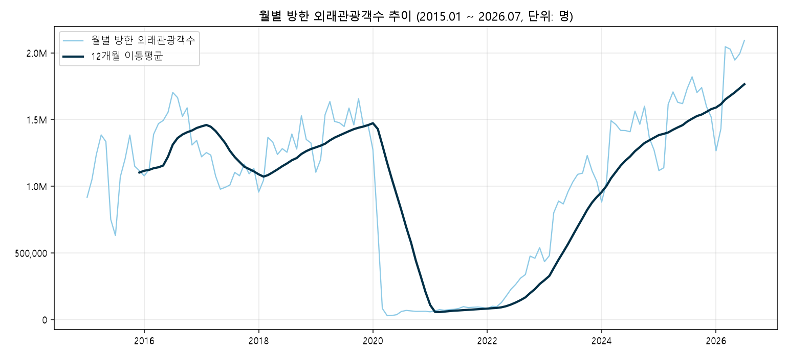
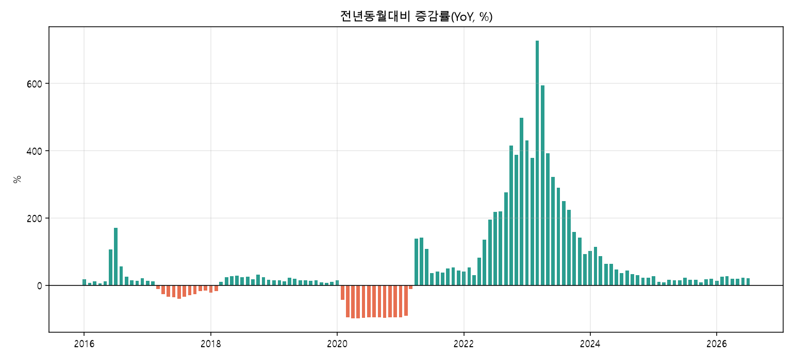
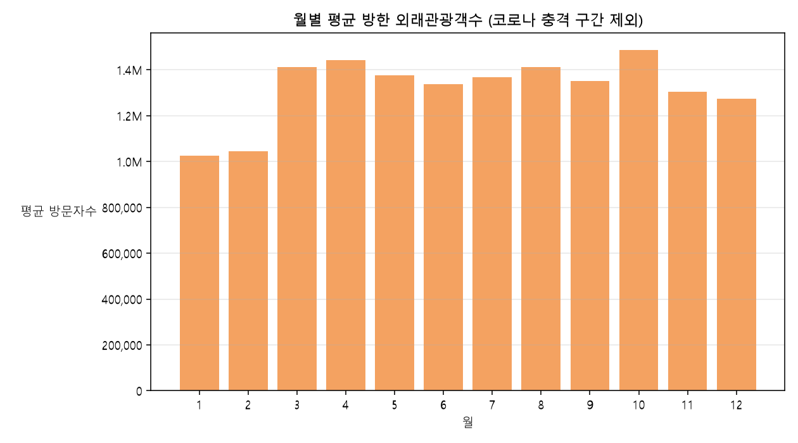
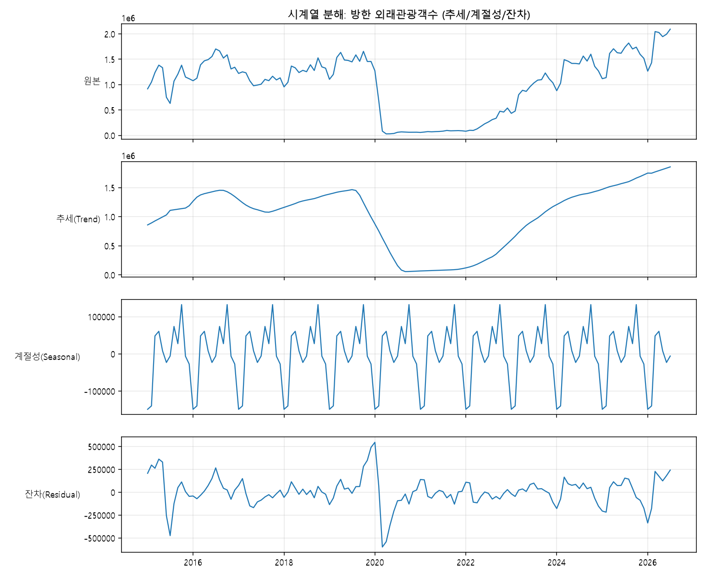

# 방한 외래관광객 월별 트렌드 분석 리포트

## 1. 분석 주제 및 선정 이유

**주제: 2015.01 ~ 2026.07 월별 방한 외래관광객수 추이**

가톨릭 성지순례 앱([visitholykorea](https://github.com/linkcontent7-huisun))을 만들고 있는데, 이 앱의 잠재 이용자 중 상당수는 해외(특히 한국 밖) 신자 방문객이다. 개별 성지의 방문객 수는 공개 통계가 없지만, **방한 외국인 관광객 전체 추이**는 그 저변이 얼마나 회복·성장하고 있는지를 보여주는 선행지표로 쓸 수 있다.

- COVID-19로 외국인 입국이 거의 끊겼다가 다시 회복되는 과정이 이 기간에 통째로 들어 있어, "충격 → 회복" 패턴을 관찰하기 좋은 데이터다.
- 월별 계절성(성수기/비수기)을 알면 앱의 다국어 콘텐츠 갱신이나 순례 캠페인을 언제 준비해야 할지 참고할 수 있다.

## 2. 분석 질문

1. 2015~2026년 전체적으로 방한 외국인 관광객 수는 상승/하락 추세가 있었는가?
2. COVID-19 충격은 언제 가장 심했고, 코로나 이전 수준을 회복한 시점은 언제인가?
3. 월별 계절성이 있는가? 성수기·비수기는 언제이며, 그 격차는 얼마나 되는가?
4. (추가) 회복기의 성장 속도는 트렌드/계절성을 분리했을 때도 뚜렷하게 보이는가?

## 3. 데이터 설명

| | |
| --- | --- |
| 출처 | [한국관광 데이터랩](https://datalab.visitkorea.or.kr) (한국관광공사) — 국가별 분석 &gt; 방한여행 현황 &gt; 국가별 방한현황(통계) |
| 수집 방법 | 대시보드가 내부적으로 호출하는 공개 API(`POST /visualize/getTempleteData.do`, qid=`NAT_07_01_001`)를 직접 호출. 로그인·인증키 불필요. [`collect_data.py`](collect_data.py) |
| 기간 | 2015년 1월 ~ 2026년 7월 (139개월) |
| 데이터 수 | 139개 (요구 조건 100개 이상 충족) |
| 컬럼 | `base_ym`(기준년월), `foreign_visitors`(방한 외래관광객수, 명) |
| 결측치 | 0건 |
| 이상치 처리 | 수집 시점 기준 아직 집계가 끝나지 않은 마지막 달(2026-08, 값 0)은 미확정 데이터로 제외. COVID-19 충격 구간(2020.03~2022.12)의 급감은 결측/오류가 아니라 실제 현상이므로 삭제하지 않고, 계절성 계산에서만 별도로 제외해 왜곡을 막았다. |
| 라이선스 | 한국관광공사 공공데이터 — 공공누리 제1유형(출처표시) 기준 |

## 4. 데이터 정제 및 시계열 분석 기법

- **12개월 이동평균(rolling mean)**: 월별 변동을 눌러서 장기 추세만 본다.
- **전년동월대비 증감률(YoY, %)**: `pct_change(12)`로 계산. 계절성을 상쇄하고 "작년 같은 달과 비교해 지금이 어떤가"를 본다.
- **월별(1~12월) 평균 집계**: 계절성 파악. COVID 충격 구간(2020.03~2022.12)은 제외하고 계산했다.
- **시계열 분해(seasonal_decompose, additive)**: 추세/계절성/잔차를 분리해 위 세 기법이 맞는지 교차 확인 (심화 옵션 A).

## 5. 시각화

### ① 월별 추이 + 12개월 이동평균


원본(하늘색)은 요동치지만 이동평균(짙은 남색)을 보면 2015~2019년의 완만한 성장, 2020~2022년의 붕괴, 2023년 이후 급격한 회복이 뚜렷이 보인다.

### ② 전년동월대비 증감률(YoY)


2020~2021년은 거의 모든 달이 -80~-98%, 2022년 말~2023년은 +100~+700%대로 튀는 "기저효과" 구간이다. 증감률만 보면 2023년이 폭발적 성장처럼 보이지만, 실제로는 코로나 최저치와 비교한 반등일 뿐이라는 점을 3번 인사이트에서 짚었다.

### ③ 월별 평균(계절성)


### ④ (보너스) 시계열 분해


## 6. 인사이트

**인사이트 1 — 관찰(Fact)**: 2020년 4월 방한 외국인 수는 29,415명으로, 1년 전인 2019년 4월(1,635,066명) 대비 **-98.2%** 감소했다. 코로나 이전(2015~2019) 월평균이 1,277,648명이었는데, 이 저점은 그 2%에도 못 미친다.
**원인(Why)**: 2020년 3~4월은 한국을 포함한 전 세계가 국경을 걸어 잠근 시점과 정확히 겹친다. 개인 방문 목적을 불문하고 입국 자체가 막혔던 시기라, 특정 관광 수요가 줄어든 게 아니라 국경 통제라는 외부 변수가 전체를 덮은 것으로 보인다.
**행동(Action)**: 성지순례 앱처럼 해외 이용자 의존도가 높은 서비스는, 이런 외생적 충격(팬데믹·비자 정책 변화 등)에 대한 대응 시나리오(국내 이용자 전환 콘텐츠 등)를 미리 준비해 둘 필요가 있다.

**인사이트 2 — 관찰(Fact)**: 12개월 이동평균이 코로나 이전 평균(1,277,648명)을 다시 넘어선 시점은 **2024년 3월**(해당 월 실측 1,491,748명)이다. 저점(2020~2022년 평균 10만 명 안팎)에서 여기까지 오는 데 약 2년간 완만한 상승 후, 2023년부터 기울기가 크게 가파라졌다.
**원인(Why)**: 회복이 균일하지 않고 2023년부터 가속된 것은, 국가별 입국 제한이 단계적으로 풀리면서 초반엔 일부 국가만, 이후 주요국 전체가 재개방된 효과가 누적된 것으로 해석할 수 있다.
**행동(Action)**: "완전 회복까지 약 4년" 이라는 관찰은, 외부 충격 이후 해외 이용자 기반이 되돌아오는 데 걸리는 시간의 하한선을 가늠하는 참고치로 쓸 수 있다.

**인사이트 3 — 관찰(Fact)**: YoY 증감률은 2023년 3월에 **+727.3%**(2022년 3월 96,768명 → 2023년 3월 800,575명)로 데이터 기간 중 최고치를 찍는다.
**원인(Why)**: 이 숫자만 보면 "2023년이 역대 최고 성장의 해"처럼 보이지만, 실측 방문자 수(800,575명)는 코로나 이전 3월 평균(약 130만 명 안팎)에도 못 미친다. 즉 증감률이 커 보이는 건 비교 기준(2022년 3월)이 극단적으로 낮았기 때문이지, 절대적인 관광 수요가 역대 최고였다는 뜻은 아니다.
**행동(Action)**: **관찰과 해석을 구분해야 하는 대표적인 사례** — 증감률 그래프만 보고 "회복이 끝났다"고 판단하면 안 되고, 반드시 절대값(①번 그래프)과 같이 봐야 한다.

**인사이트 4 — 관찰(Fact)**: 코로나 충격 구간을 제외하고 월별 평균을 내면 **10월이 1,486,294명으로 가장 많고, 1월이 1,024,694명으로 가장 적다.** 성수기(10월)와 비수기(1월) 격차는 약 45만 명, 비율로는 약 1.45배다.
**원인(Why)**: 10월은 한국의 단풍철·쾌적한 기온과 추석 연휴 등이 겹치는 시기라 관광 수요가 자연스럽게 몰리는 것으로 보이고, 1월은 한겨울 추위와 설 연휴 전후 시점이라 상대적으로 방문이 적은 것으로 해석된다.
**행동(Action)**: 성지순례 앱의 다국어 콘텐츠 갱신이나 순례 캠페인 홍보는 방문자가 몰리는 8~10월 이전(늦여름)에 준비를 끝내 두는 편이 유리해 보인다.

## 7. 결론 및 한계점

**결론**: 방한 외국인 관광객 수는 ① 2015~2019년 완만한 성장 → ② 2020~2022년 코로나로 사실상 붕괴(-98%) → ③ 2023년부터 급격히 회복해 2024년 3월 코로나 이전 평균을 재돌파 → ④ 계절적으로는 10월에 몰리고 1월에 적은, 뚜렷한 성수기/비수기 구조를 가진 시계열이다.

**한계점**:
- 이 데이터는 **"전체 방한 외국인"** 수치이며, 종교/성지순례 목적 방문자를 별도로 집계한 공개 통계는 찾지 못했다. 성지순례 앱의 실제 타겟과의 관계는 **가정(전체 외국인 관광 수요가 늘면 성지순례 잠재 방문객도 함께 늘 것이다)**일 뿐, 직접 검증된 인과관계는 아니다.
- 국가별 세부 데이터(코로나 회복 속도가 국가마다 다름)를 통합해 총합만 봤기 때문에, 유럽·미주 등 가톨릭 신자가 많은 지역만 따로 떼어보면 패턴이 다를 수 있다.
- 환율·유가 등 원자재/거시 변수는 원본 API 응답에 함께 담겨 있었으나, 이번 분석에서는 방문자 수 자체에 집중하기 위해 사용하지 않았다.

## 8. AI 사용 로그

| 사용 작업 | 사용 이유 | 검증 방법 |
| --- | --- | --- |
| 데이터 수집 스크립트 작성 (한국관광 데이터랩 API 리버스엔지니어링) | 공식 오픈API(data.go.kr)는 별도 활용신청·승인 대기가 필요해, 로그인 없이 즉시 쓸 수 있는 공개 대시보드의 내부 API를 대신 찾아 시간을 절감했다 | 브라우저에서 실제 대시보드가 호출하는 요청을 가로채 파라미터를 확인하고, 동일한 요청을 코드로 재현해 웹 화면에 표시된 숫자(예: 전체 방한 외래관광객 21,180,538명)와 대조해 일치함을 확인했다 |
| 전처리·시계열 분석 코드 작성(이동평균/YoY/계절성/분해) | 반복적인 pandas/matplotlib 코드를 빠르게 작성하기 위해 | 코드를 직접 실행해 출력된 수치를 REPORT.md의 인사이트에 그대로 인용하고, 각 수치를 원본 CSV에서 재조회해 재현되는지 확인했다(예: 2020-04 29,415명, 2019-04 1,635,066명을 CSV에서 직접 grep으로 재확인) |
| 인사이트 해석 문장 초안 작성 | 관찰(수치)과 해석(가설)을 구분해 쓰는 형식을 일관되게 유지하기 위해 | 각 인사이트의 "관찰" 부분이 실제 데이터/차트와 일치하는지 대조했고, "해석" 부분은 확정적 사실이 아니라 가능한 원인 중 하나로 서술(단정적 표현 배제)했다 |

## 9. 재현 방법

```bash
cd assignments/M1-1-tourism-trend
python -m venv .venv
.venv/Scripts/activate   # Windows
pip install -r requirements.txt
python collect_data.py   # data/kto_foreign_visitors_monthly.csv 생성
python analysis.py       # images/*.png 생성 + 요약 통계 출력
```
